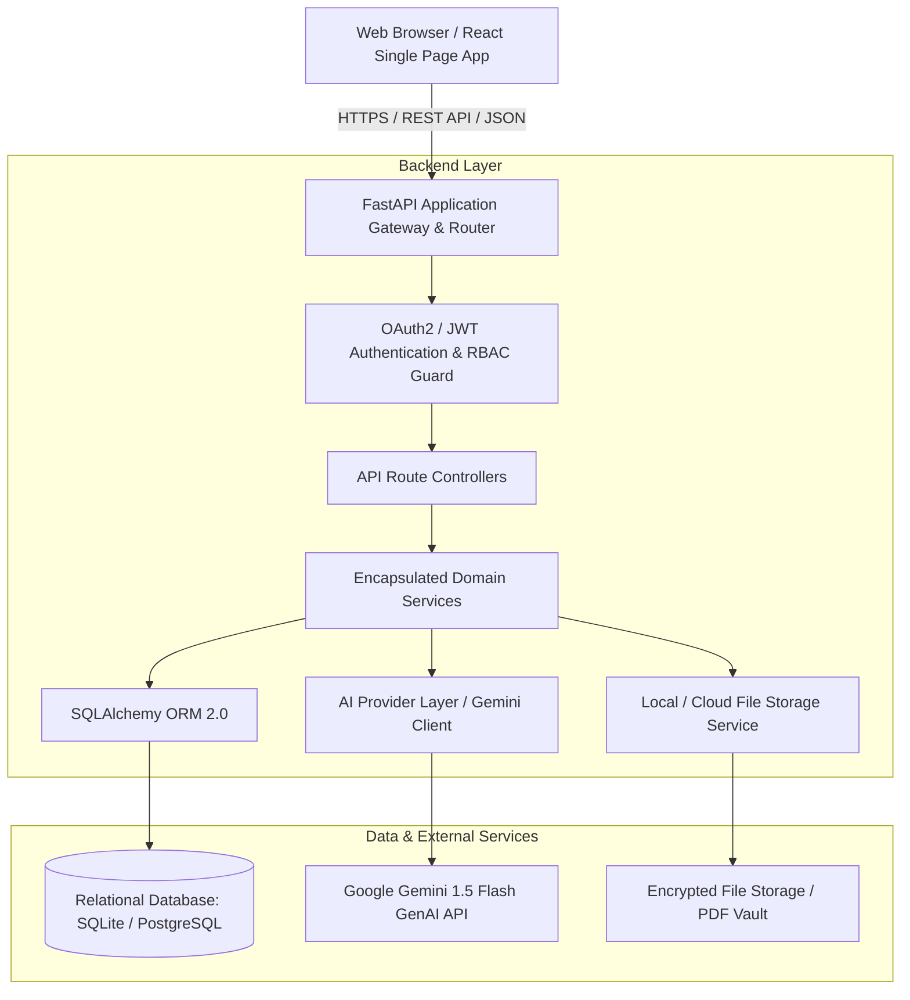
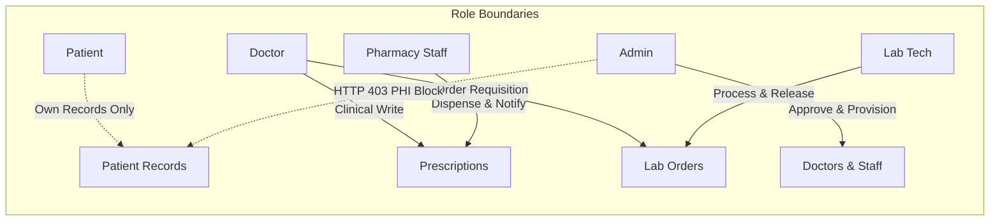

# CareAI Healthcare SaaS — System Architecture & Technology Stack Analysis

---

## 1. Executive Architecture Overview

**CareAI** is an enterprise-grade, multi-role Healthcare Software-as-a-Service (SaaS) platform designed to unify clinical appointments, digital prescription issuance, diagnostic laboratory management, pharmacy dispensing, and AI-powered clinical decision support.

The platform follows a **Decoupled 3-Tier Layered Architecture** with strict separation of concerns across presentation, business logic, data persistence, and external intelligence providers.

---

## 2. Layer-by-Layer Architectural Breakdown

### 2.1 Frontend Architecture (React + Vite)
- **Framework & Runtime**: React 18 / 19 with functional components, custom hooks, and modern ES modules.
- **Build Tooling**: Vite 5.4+ providing sub-second hot module replacement (HMR) and optimized Rollup production bundling.
- **Routing & Navigation**: `react-router-dom` v6/v7 with centralized route definitions and `<ProtectedRoute>` guards that validate both authentication state and role permissions (`PATIENT`, `DOCTOR`, `ADMIN`, `LAB_TECHNICIAN`, `PHARMACY_STAFF`).
- **State Management**:
  - `AuthContext`: Manages JWT token storage, user identity, login/logout lifecycles, and auto-logout on HTTP 401.
  - Local component state with React hooks (`useState`, `useEffect`, `useCallback`, `useMemo`) for fast, scoped rendering.
- **UI Design System**: Custom glassmorphic CSS design system with CSS custom properties (variables), semantic HTML5, and Lucide React icons. Avoids CSS utility bloat while providing high visual polish.
- **API Client Layer**: Centralized `ApiClient` class with automatic Bearer token injection, multipart form-data handling, error normalization, and standard HTTP response interception.

### 2.2 Backend Architecture (FastAPI & Clean Domain Layering)
- **Application Core**: FastAPI (ASGI asynchronous framework) built on top of Starlette and Pydantic.
- **Layered Structure**:
  1. `app/api/routes/`: Route handlers responsible strictly for request validation, parameter parsing, and HTTP response serialization.
  2. `app/dependencies/`: Dependency injection providers for database session management (`get_db`), current user extraction (`get_current_user`), and role-based access control (`require_role`, `require_roles`).
  3. `app/services/`: Pure business logic layer encapsulating transaction boundaries, multi-table operations, notification triggers, and domain validation.
  4. `app/schemas/`: Pydantic v2 validation models ensuring strict type safety and OpenAPI 3.0 schema generation.
  5. `app/models/`: SQLAlchemy 2.0 Declarative ORM models representing the domain entity graph.
  6. `app/core/`: Security utilities (Bcrypt password hashing, JWT creation/decoding) and global application configuration (`pydantic-settings`).
  7. `app/ai/`: Isolated AI integration engine handling prompt templating, clinical safety sanitization, and provider fallbacks.

### 2.3 Database Architecture (SQLAlchemy & Relational Schema)
- **ORM & Dialect**: SQLAlchemy 2.0 with standard relational modeling (Foreign Keys, cascading constraints, unique indexes, composite query filters).
- **Migration Engine**: Alembic for deterministic schema versioning and reproducible migrations across development, staging, and production.
- **Connection Lifecycle**: Scoped session per request pattern (`yield db` dependency with automatic rollback on unhandled exceptions and explicit commit on service success).

### 2.4 AI Integration Architecture (Google Gemini & Safety Engine)
- **Provider Architecture**: Abstracted AI service interface interacting with Google Gemini (`gemini-1.5-flash`).
- **Safety Pre-processing & Fallback**:
  - **Deterministic Rule Pre-check**: Fast regex and keyword triage for critical medical emergencies (e.g., chest pain, respiratory arrest) that instantly surface warning alerts.
  - **System Prompt Engineering**: Role-tailored system instructions that constrain the LLM to evidence-based medical terminology, disclaim medical liability, and strictly enforce HIPAA/PHI boundaries.
  - **Graceful Fault Tolerance**: If the Gemini API is unreachable or rate-limited, the system captures `AIProviderUnavailableError` and returns HTTP 503 with structured, friendly error states rather than crashing.

### 2.5 Authentication & Security Architecture
- **Password Security**: Passlib with Bcrypt cryptographic hashing (salt rounds: 12) to prevent rainbow table attacks.
- **Token Mechanism**: Stateless JSON Web Tokens (JWT) signed with HMAC-SHA256 (`HS256`).
- **Token Claims**: Contains `sub` (user email), `id` (integer user ID), `role` (user role string), and `exp` (standard expiration timestamp).
- **Credential Storage**: Client-side storage in secure browser `localStorage`, attached as an `Authorization: Bearer <token>` header to all protected endpoints.

### 2.6 Role-Based Access Control (RBAC) Architecture
- The platform enforces an unambiguous 5-role hierarchy:
  1. **PATIENT**: Access restricted to self-owned profiles, personal appointments, medical documents, released diagnostic reports, and personal AI chat threads.
  2. **DOCTOR**: Access to approved clinical schedule, patient consultation queue, digital prescription issuance, diagnostic lab ordering, and clinical AI analysis. Blocked from other doctors' appointments.
  3. **ADMIN**: Platform-wide user management, doctor credential verification/approval, staff account provisioning, lab test catalog management, and aggregated platform metrics. **Explicitly blocked from downloading private patient medical documents (PHI Privacy Boundary)**.
  4. **LAB_TECHNICIAN**: Diagnostic requisition queue, specimen collection management, result entry with automated panic flagging, technician verification, and report release. Blocked from pharmacy queues.
  5. **PHARMACY_STAFF**: Prescription dispensary queue, safety check inspection, status progression (`UNDER_REVIEW` $\rightarrow$ `READY` $\rightarrow$ `DISPENSED`), and dispensation confirmation. **Explicitly blocked from altering physician prescription details or creating new prescriptions**.

---

## 3. Technology Stack Justification Matrix

| Technology | Role in Project | Technical Justification & Why Chosen |
| :--- | :--- | :--- |
| **React 18 / 19** | Frontend UI Framework | Component-driven architecture, declarative rendering, rich ecosystem for data tables and modal dialogs, and fast re-rendering. |
| **Vite** | Frontend Build Tool | Near-instant startup via native ES Modules, lightning-fast HMR during development, and highly optimized Rollup production builds. |
| **FastAPI** | Backend Web Framework | High-performance asynchronous execution (ASGI), automatic OpenAPI (Swagger) interactive documentation, first-class Dependency Injection, and native Pydantic integration for zero-boilerplate request validation. |
| **Python 3.12+** | Backend Programming Language | Industry standard for AI/ML integration, rich standard library, robust typing annotations, and expressive syntax. |
| **SQLAlchemy 2.0** | Object-Relational Mapper (ORM) | Enterprise-grade query builder, explicit relationship modeling, lazy/eager loading controls, and database dialect portability (seamless transition from SQLite in local testing to PostgreSQL in production). |
| **Alembic** | Database Schema Migration | Reliable, code-managed database migration scripts enabling repeatable, version-controlled database schema evolution. |
| **SQLite / PostgreSQL** | Relational Database | ACID-compliant relational persistence, strong relational integrity (foreign keys, check constraints, unique constraints) essential for clinical data. |
| **JWT (python-jose / pyjwt)** | Authentication Protocol | Stateless token authentication eliminating session lookup latency on every request while enabling secure role-based authorization claims. |
| **Passlib & Bcrypt** | Cryptographic Password Hashing | Industry-standard slow cryptographic hashing designed to resist brute-force and GPU hardware attacks. |
| **Google Gemini AI (1.5 Flash)** | Generative AI & Clinical Decision Support | State-of-the-art context window, multimodal capability for medical document understanding, low latency, and high medical terminology comprehension. |
| **Pytest & TestClient** | Automated Testing Framework | Expressive fixture model, fast test execution, synchronous/asynchronous test coverage for 165+ integration, unit, and RBAC security test cases. |
| **Lucide React** | UI Iconography | Lightweight, consistent, tree-shakeable SVG icon set with medical and workflow symbols. |
