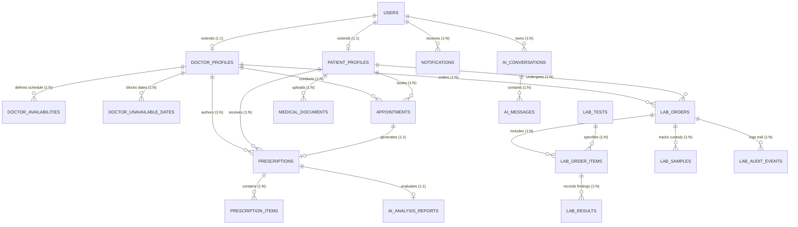

# CareAI Healthcare SaaS — Database Architecture & Data Dictionary

---

## 1. Conceptual Entity-Relationship (ER) Diagram

---

## 2. Core Database Entities & Data Dictionary

### 2.1 User & Identity Management
| Entity Model | Table Name | Purpose | Key Attributes |
| :--- | :--- | :--- | :--- |
| **`User`** | `users` | Base identity for all system actors. Stores login credentials, active status, role string, and verification flag. | `id`, `email`, `hashed_password`, `full_name`, `phone_number`, `role` (`PATIENT`, `DOCTOR`, `ADMIN`, `LAB_TECHNICIAN`, `PHARMACY_STAFF`), `is_active`, `is_verified`. |
| **`PatientProfile`** | `patient_profiles` | Clinical profile for patient users including emergency contact, allergies, chronic conditions, and blood type. | `id`, `user_id` (FK: `users.id`), `date_of_birth`, `gender`, `blood_group`, `emergency_contact`, `allergies`, `chronic_conditions`. |
| **`DoctorProfile`** | `doctor_profiles` | Professional credential record for physicians subject to administrative vetting. | `id`, `user_id` (FK: `users.id`), `specialization`, `license_number`, `years_of_experience`, `hospital_affiliation`, `bio`, `consultation_fee`, `approval_status` (`PENDING`, `APPROVED`, `REJECTED`). |

### 2.2 Appointments & Availability
| Entity Model | Table Name | Purpose | Key Attributes |
| :--- | :--- | :--- | :--- |
| **`DoctorAvailability`** | `doctor_availabilities` | Weekly recurring consultation availability window for a doctor. | `id`, `doctor_id` (FK: `doctor_profiles.id`), `day_of_week` (0-6), `start_time`, `end_time`, `slot_duration_minutes`, `is_active`. |
| **`DoctorUnavailableDate`** | `doctor_unavailable_dates` | Ad-hoc vacation or holiday dates where doctor schedule is blocked. | `id`, `doctor_id` (FK: `doctor_profiles.id`), `unavailable_date`, `reason`. |
| **`Appointment`** | `appointments` | Consultation booking record binding a patient and a doctor to a designated time slot. | `id`, `patient_id` (FK: `patient_profiles.id`), `doctor_id` (FK: `doctor_profiles.id`), `scheduled_start`, `scheduled_end`, `status` (`PENDING`, `CONFIRMED`, `CANCELLED`, `COMPLETED`, `REJECTED`), `chief_complaint`, `cancellation_reason`. |

### 2.3 Prescriptions & Clinical Safety
| Entity Model | Table Name | Purpose | Key Attributes |
| :--- | :--- | :--- | :--- |
| **`Prescription`** | `prescriptions` | Clinical prescription issued by a doctor following a consultation, tracked through pharmacy dispensary. | `id`, `appointment_id` (FK: `appointments.id`), `patient_id`, `doctor_id`, `diagnosis`, `clinical_notes`, `status` (`PRESCRIBED`, `UNDER_REVIEW`, `READY`, `DISPENSED`, `CANCELLED`), `pharmacist_notes`, `dispensed_at`, `dispensed_by_user_id`. |
| **`PrescriptionItem`** | `prescription_items` | Individual drug line item specifying medication, dosage, route, frequency, and duration. | `id`, `prescription_id` (FK: `prescriptions.id`), `medication_name`, `dosage`, `frequency`, `duration`, `instructions`. |
| **`AIAnalysisReport`** | `ai_reports` | Persisted clinical AI drug-drug, drug-food, and allergy interaction analysis attached to a prescription. | `id`, `prescription_id` (FK: `prescriptions.id`), `severity` (`NONE`, `LOW`, `MODERATE`, `HIGH`, `CRITICAL`), `summary`, `interaction_details`, `food_interactions`, `precautions`, `raw_model_response`. |

### 2.4 Diagnostic Laboratory Management
| Entity Model | Table Name | Purpose | Key Attributes |
| :--- | :--- | :--- | :--- |
| **`LabTest`** | `lab_tests` | Standardized test catalog maintained by administrators with reference ranges and specimen requirements. | `id`, `code` (e.g. `CBC-001`), `name`, `category`, `specimen_type`, `unit`, `reference_range_min`, `reference_range_max`, `panic_low`, `panic_high`, `price`. |
| **`LabOrder`** | `lab_orders` | Diagnostic order requisition issued by a physician or requested by a patient. | `id`, `order_number`, `patient_id`, `doctor_id`, `priority` (`ROUTINE`, `URGENT`, `STAT`), `status` (`SAMPLE_PENDING`, `SAMPLE_COLLECTED`, `IN_PROGRESS`, `RESULTS_ENTERED`, `VERIFIED`, `RELEASED`, `CANCELLED`), `clinical_indication`, `verified_by_user_id`, `verified_at`, `released_at`. |
| **`LabOrderItem`** | `lab_order_items` | Line item in a lab order linking to a specific `LabTest`. | `id`, `order_id` (FK: `lab_orders.id`), `lab_test_id` (FK: `lab_tests.id`), `status`. |
| **`LabSample`** | `lab_samples` | Specimen collection and custody tracking record with rejection handling for compromised draws. | `id`, `order_id` (FK: `lab_orders.id`), `specimen_type`, `sample_condition` (`ACCEPTABLE`, `HEMOLYZED`, `CLOTTED`, `INSUFFICIENT_VOLUME`, `LEAKING`), `collected_by_user_id`, `collected_at`, `rejection_reason`. |
| **`LabResult`** | `lab_results` | Quantitative analyte findings entered by laboratory technicians. | `id`, `order_item_id` (FK: `lab_order_items.id`), `parameter_name`, `numeric_value`, `text_value`, `unit`, `flag` (`NORMAL`, `ABNORMAL`, `CRITICAL`), `entered_by_user_id`, `entered_at`. |
| **`LabAuditEvent`** | `lab_audit_events` | Immutable chain-of-custody audit log for compliance. | `id`, `order_id` (FK: `lab_orders.id`), `action`, `actor_user_id`, `timestamp`, `details`. |

### 2.5 Medical Documents, Notifications & AI Threads
| Entity Model | Table Name | Purpose | Key Attributes |
| :--- | :--- | :--- | :--- |
| **`MedicalDocument`** | `medical_documents` | Patient-uploaded medical files (PDFs, images) with OCR extraction and AI clinical summaries. | `id`, `patient_id` (FK: `patient_profiles.id`), `title`, `document_type` (`LAB_REPORT`, `PRESCRIPTION`, `DISCHARGE_SUMMARY`), `storage_key`, `file_size_bytes`, `extracted_text`, `ai_summary`. |
| **`Notification`** | `notifications` | In-app notification queue delivering event updates to users. | `id`, `user_id` (FK: `users.id`), `title`, `message`, `type` (`APPOINTMENT`, `PRESCRIPTION`, `LAB_REPORT`, `DOCTOR_APPROVAL`, `SYSTEM`), `priority`, `is_read`, `created_at`. |
| **`AIConversation`** | `ai_conversations` | Multi-turn chat conversation threads with CareAI Assistant. | `id`, `user_id` (FK: `users.id`), `role_context`, `title`, `created_at`, `updated_at`. |
| **`AIMessage`** | `ai_messages` | Individual message entries within an AI conversation. | `id`, `conversation_id` (FK: `ai_conversations.id`), `sender` (`user`, `assistant`), `content`, `safety_metadata`, `created_at`. |

---

## 3. Data Integrity & Indexing Strategy

1. **Foreign Key Enforcement**: All child tables enforce `ON DELETE CASCADE` or `RESTRICT` depending on clinical significance (e.g., deleting a user cascades to profile, but prescriptions cannot be orphaned).
2. **Unique Constraints**:
   - `users.email` (Unique login identifier)
   - `doctor_profiles.license_number` (Unique medical license)
   - `lab_tests.code` (Unique test catalogue code)
   - `lab_orders.order_number` (Unique accession sequence)
3. **Optimized Indexes**:
   - `appointments(patient_id, doctor_id, scheduled_start)` for rapid calendar queries.
   - `prescriptions(patient_id, status)` for pharmacy dispensary queue retrieval.
   - `lab_orders(status, priority)` for lab technologist triage.
