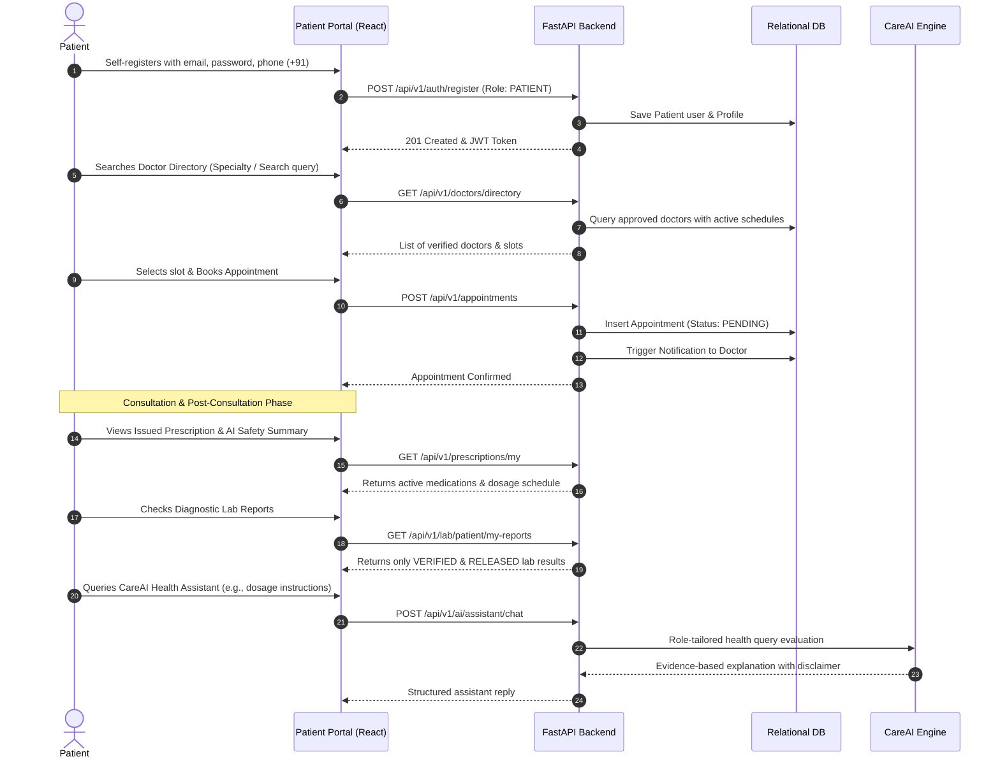
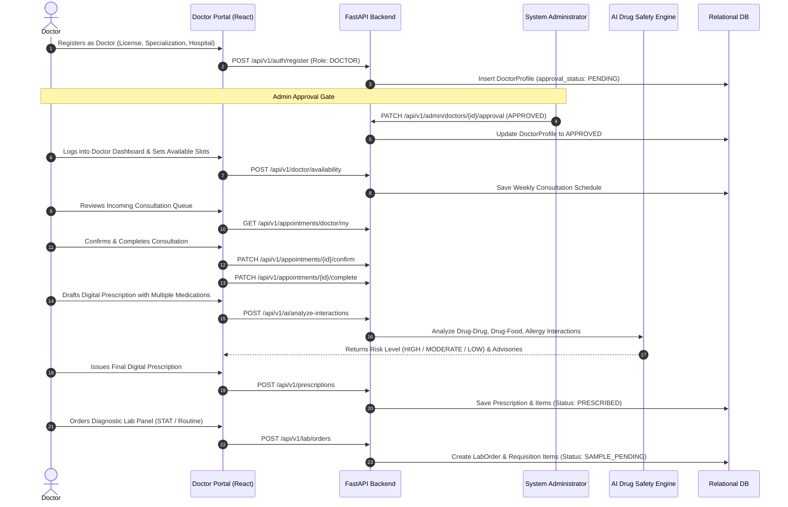
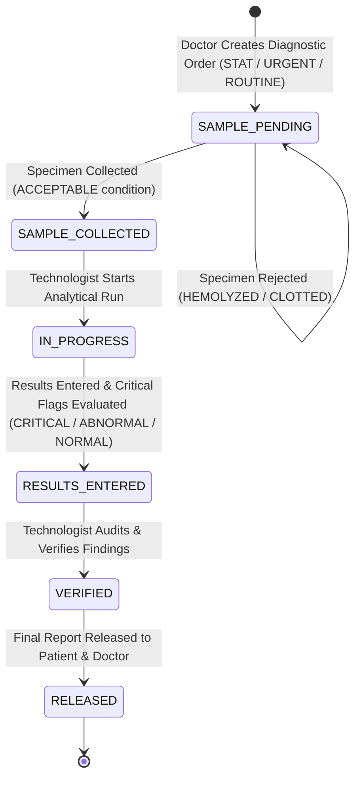
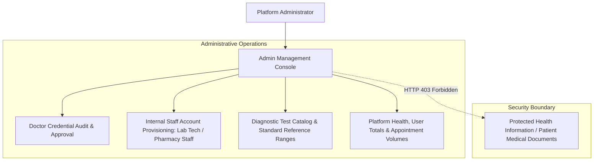
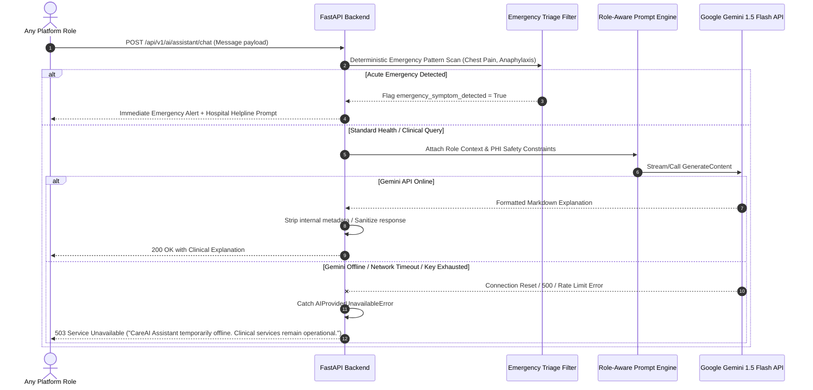

# CareAI Healthcare SaaS — End-to-End System Workflows

---

## 1. Patient Journey Workflow

The patient journey covers self-registration, finding certified specialists, booking appointments, attending consultations, accessing digital prescriptions, reviewing released diagnostic lab reports, picking up medications from the pharmacy, and interacting with the CareAI Assistant.

---

## 2. Doctor Journey Workflow

The doctor journey encompasses credential registration, administrative vetting, dynamic consultation management, digital prescription drafting with automated drug-drug interaction screening, and STAT/routine lab ordering.

---

## 3. Laboratory Diagnostic Workflow

The diagnostic lab workflow enforces a rigorous clinical custody chain: order reception, biological specimen collection with rejection criteria for compromised draws (hemolyzed/clotted), processing, result parameter entry with automated panic threshold alerts, technologist verification, and final report release to the patient portal.

---

## 4. Pharmacy Dispensary Workflow

The dispensary lifecycle guarantees that pharmacy personnel can process orders through distinct stages while preventing any modification of doctor prescriptions.

```mermaid
stateDiagram-v2
    [*] --> PRESCRIBED: Doctor Issues Digital Prescription
    
    PRESCRIBED --> UNDER_REVIEW: Pharmacist Opens & Audits Medication Queue
    
    UNDER_REVIEW --> READY: Pharmacist Packages Medication & Marks Ready for Pickup
    note right of READY
        Automated in-app notification 
        dispatched to Patient: "Ready for Pickup"
    end note
    
    READY --> DISPENSED: Patient Receives Medication; Pharmacist Confirms Dispensation
    note right of DISPENSED
        Dispensation timestamp and pharmacist ID recorded.
        Notifications sent to Patient and Prescribing Doctor.
    end note
    
    DISPENSED --> [*]
```

---

## 5. System Administrator Workflow

Administrators manage the health, governance, and user safety of the CareAI ecosystem without violating patient medical privacy.

---

## 6. AI Intelligence & Fault-Tolerant Processing Workflow

The AI subsystem processes conversational prompts, multi-drug interactions, and medical document OCR with deterministic rule filters, system prompt guardrails, and graceful service degradation.

